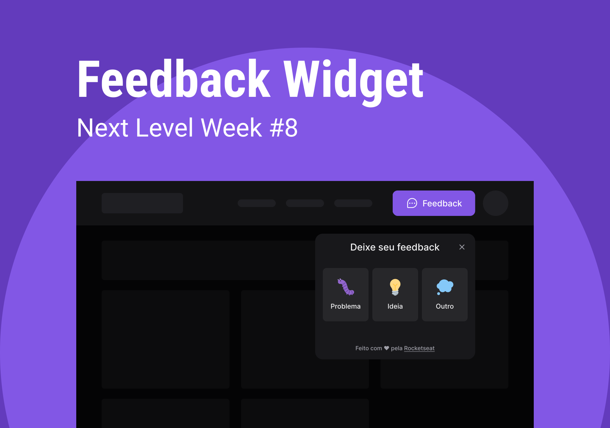

<p align="center">
  
</p>

<p align="center">
  
</p>

<h1 align="center">
    
</h1>

<br>

## 🧪 Tecnologias

Esse projeto foi desenvolvido com as seguintes tecnologias:

- [React](https://reactjs.org)
- [Tailwind](https://tailwindcss.com)
- [ViteJS](https://vitejs.dev)
- [Phosphor - Icons](https://phosphoricons.com)
- [TypeScript](https://www.typescriptlang.org/)

## 🚀 Como executar

Clone o projeto e acesse a pasta do mesmo.

```bash
$ git clone https://github.com/samuel-ventura/nlw-return-impulse-web
$ cd nlw-return-impulse-web
```

Para iniciá-lo, siga os passos abaixo:
```bash
# Instalar as dependências
$ npm install

# Iniciar o projeto
$ npm run dev
```
O app estará disponível no seu browser pelo endereço http://localhost:3000.

Lembrando que será necessário ter o [Tailwind](https://tailwindcss.com) e o [ViteJS](https://vitejs.dev) instalados e todas as outras dependências.

## 💻 Projeto

O FeedbackWidget é uma ferramenta que pode ser acoplada a diversas plataformas e aplicações WEB, para recebimentos de erros, sugestões e mais outras necessidades que podem ser adaptadas.

Este é um projeto desenvolvido durante a **[Next Level Week Return](https://nextlevelweek.com/)**, apresentada dos dias 01 a 08 de maio de 2022.

## 🌎 Aplicação

Você pode acessar a aplicação do projeto através do link abaixo:

- [Aplicação](https://nlw-return-impulse-web-omega.vercel.app) 

## 🔖 Layout

Você pode visualizar o layout do projeto através do link abaixo:

- [Layout Web](https://www.figma.com/community/file/1102912516166573468/Feedback-Widget) 

Lembrando que você precisa ter uma conta no [Figma](http://figma.com/).

---

Feito com 💜 by Samuel Ventura + Rocketseat 👋🏻 [Participe da comunidade Rocket](https://discord.gg/gKUVrzrPrU)